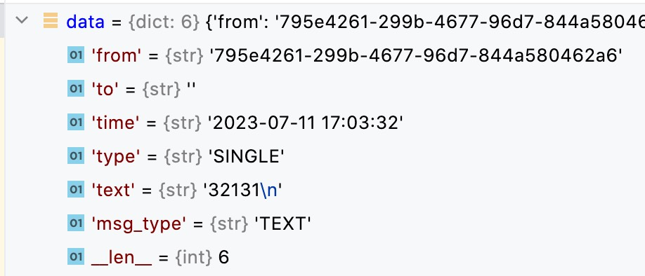
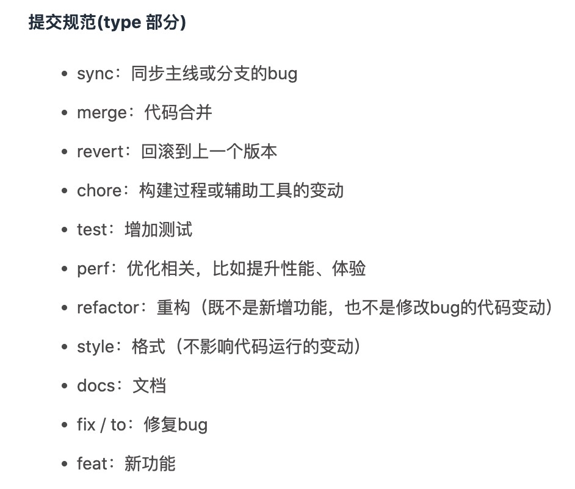

# comnet_cdesign_backend 
> config文件夹已隐藏

## 说明

### 目录结构

models下放数据模型，routers下放接口及处理逻辑，utils为工具类，main为主入口

### 关键数据结构

1. 接口返回结果：`utils.response`

`response_msg()`为响应http请求的返回类型，调用时传入`'e'`代表出错，传入`'s'`代表成功。具体见项目代码。

`response_ws()`为响应WebSocket的返回类型，`msg_type`字段**有待商榷!**

2. 传输用的数据类型：`utils.types`
3. WebSocket传输的聊天消息的数据结构

### Git提交规范  [type]: [modules] abstract

1. type部分遵从下图
2. modules为涉及到更改的代码模块（可选main,utils,routers,models,imgs,readme等，多个模块使用**英文逗号+空格**的形式隔开）
3. abstract简要描述出更改的内容

